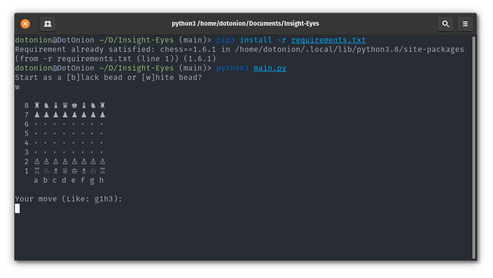
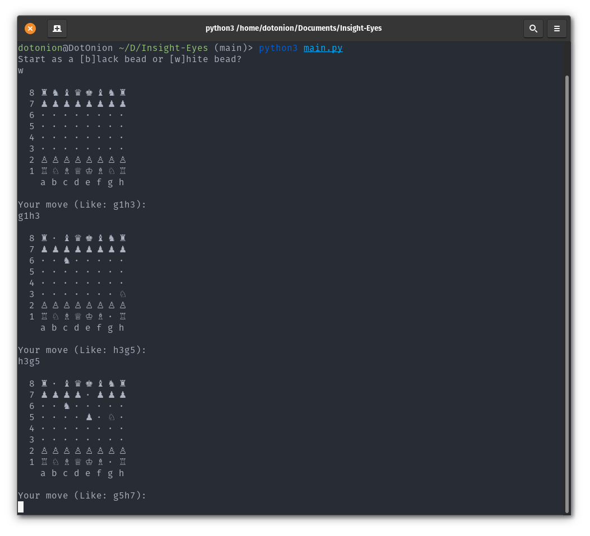

<h1 align=center>
    
    <br />
    <br />
    Insight Eyes
    <br />
    <a href="https://github.com/d0t0n10n/insight-eyes">
        
    </a>
    <br />
    <a href="https://github.com/d0t0n10n/insight-eyes/commits/main">
        
    </a>
    <br />
    <a href="https://github.com/Naereen?tab=followers">
        
    </a>
    <a href="https://github.com/d0t0n10n/insight-eyes/blob/master/License">
        
    </a>
    <br />
    <a href="https://GitHub.com/d0t0n10n/insight-eyes/watchers/">
        
    </a>
    <a href="https://GitHub.com/d0t0n10n/insight-eyes/stargazers/">
        
    </a>
    <a href="https://GitHub.com/d0t0n10n/insight-eyes/network/">
        
    </a>
    <br />
    <a href="https://github.com/d0t0n10n/insight-eyes">
        
    </a>
    <a href="https://github.com/d0t0n10n/insight-eyes">
        
    </a>
    <a href="https://github.com/d0t0n10n/insight-eyes">
        
    </a>
    <br />
    <a href="https://python.org">
        
    </a>
    <a href="https://open.vscode.dev/d0t0n10n/insight-eyes">
        
    </a>
    <a href="https://repl.it/github/d0t0n10n/insight-eyes">
        
    </a>
</h1>

Hi everyone!
<br />
This project is a chess AI ([chess-engine](https://en.wikipedia.org/wiki/Chess_engine)).

**What is Chess-Engine?**
<br />
A chess-engine is usually a back-end with a command line interface without graphics or windows. Engines are usually used with a front-end, a graphical user interface with window like Chessbase or WinBoard. Many chess engines are now available for mobile phones and tablets, making them even more accessible. Chess engines can play against multiple engines without having to learn a new user interface for each one. So different engines can play against other and the user can play with multiple engines.

## Tech Stack

- [**Alpha–beta Pruning**](https://en.wikipedia.org/wiki/Alpha%E2%80%93beta_pruning) for move searching: <br />
  Alpha-Beta Pruning is a search algorithm that aims to reduce the number of nodes evaluated by the minimax algorithm in its search tree. It is an adversarial search algorithm commonly used for machine play of two-person games. It stops evaluating a move when it finds at least one possibility that proves the move is worse than a previously examined move. When applied to a standard minimax tree, it returns the same move as the minimax but cuts off branches that cannot affect the final decision.
- [**Move Ordering**](https://www.chessprogramming.org/Move_Ordering): <br />
  For the alpha-beta algorithm to perform well, the best moves need to be searched first. The goal is to become close to the minimal tree. On the other hand - at Cut-nodes - the best move is not always the cheapest refutation. Most important inside an iterative deepening framework is to try the principal varieties of the previous iteration as the leftmost path for the next iteration, which might be applied by an explicit triangular PV-table or implicit by the transposition table.
- [**Simplified Evaluation Function**](https://www.chessprogramming.org/Simplified_Evaluation_Function): <br />
  The content of this page has been originally posted by Tomasz Michniewski on the Polish chess programming discussion list (progszach) It contains a proposal of extremely basic evaluation function required from the participants of a "Unified Evaluation" test tournament. Please note that the values presented here have been designed specifically to compensate for the lack of any other chess knowledge, and not for being supplemented by it. There are two parts to this email, the first is about simple piece values, the second is about piece-square tables.

## Authors

- [**@dotOnion**](https://d0t0n10n.github.io/)
- Praise to [**Andrew Healey**](https://github.com/healeycodes) and **Roma Parramore** for their [**Andoma**](https://github.com/healeycodes/andoma).

## Installation

You can install all the necessary packages and libraries with the following command:

`$ pip3 install -r requirements.txt`

## Usage

You can use this projectwith the following command:

```
$ python3 main.py

Start as a [b]lack bead or [w]hite bead?
w

  8 ♖ ♘ ♗ ♕ ♔ ♗ ♘ ♖
  7 ♙ ♙ ♙ ♙ ♙ ♙ ♙ ♙
  6 · · · · · · · ·
  5 · · · · · · · ·
  4 · · · · · · · ·
  3 · · · · · · · ·
  2 ♟ ♟ ♟ ♟ ♟ ♟ ♟ ♟
  1 ♜ ♞ ♝ ♛ ♚ ♝ ♞ ♜
    a b c d e f g h

Your move (Like: g1h3):
```

## ScreenShots

 <br />


## License

[MIT](https://github.com/d0t0n10n/insight-eyes/blob/main/license)

```
MIT License

Copyright (c) 2021 Hesam Tavakoli

Permission is hereby granted, free of charge, to any person obtaining a copy
of this software and associated documentation files (the "Software"), to deal
in the Software without restriction, including without limitation the rights
to use, copy, modify, merge, publish, distribute, sublicense, and/or sell
copies of the Software, and to permit persons to whom the Software is
furnished to do so, subject to the following conditions:

The above copyright notice and this permission notice shall be included in all
copies or substantial portions of the Software.

THE SOFTWARE IS PROVIDED "AS IS", WITHOUT WARRANTY OF ANY KIND, EXPRESS OR
IMPLIED, INCLUDING BUT NOT LIMITED TO THE WARRANTIES OF MERCHANTABILITY,
FITNESS FOR A PARTICULAR PURPOSE AND NONINFRINGEMENT. IN NO EVENT SHALL THE
AUTHORS OR COPYRIGHT HOLDERS BE LIABLE FOR ANY CLAIM, DAMAGES OR OTHER
LIABILITY, WHETHER IN AN ACTION OF CONTRACT, TORT OR OTHERWISE, ARISING FROM,
OUT OF OR IN CONNECTION WITH THE SOFTWARE OR THE USE OR OTHER DEALINGS IN THE
SOFTWARE.
```

## Ending

If you have any feedback, please reach out to us at [here](mailto:d0t0n10n@pm.me). <br />
And here is a related project: [**Andoma**](https://github.com/healeycodes/andoma) by [**Andrew Healey**](https://github.com/healeycodes) and **Roma Parramore**!
